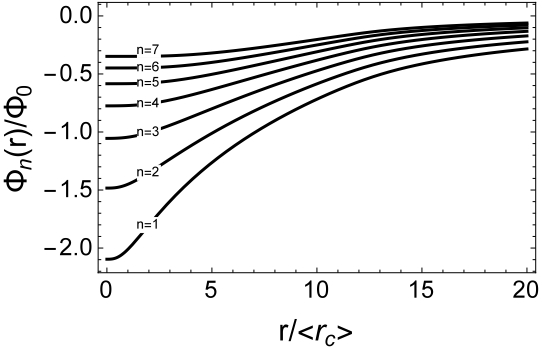
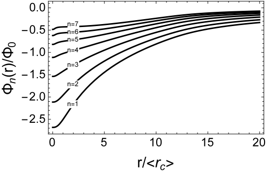
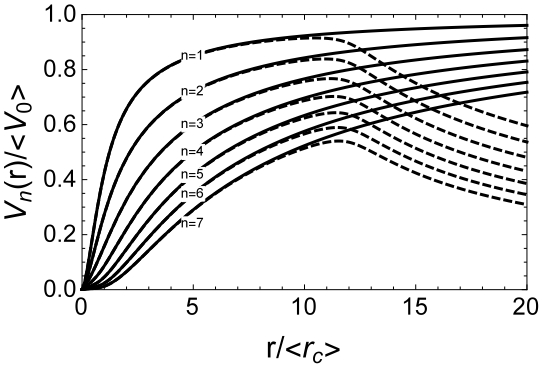
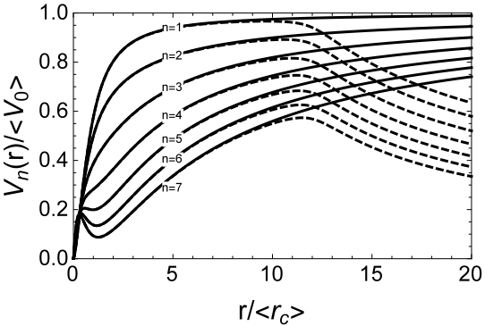
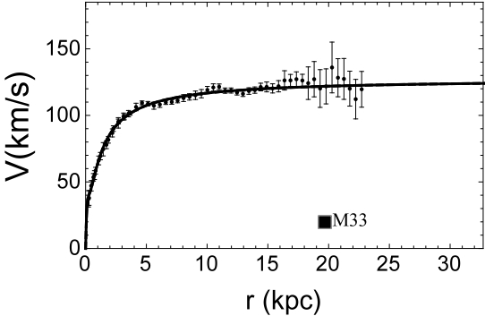
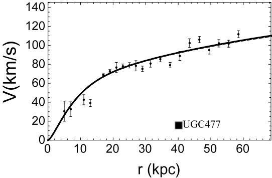
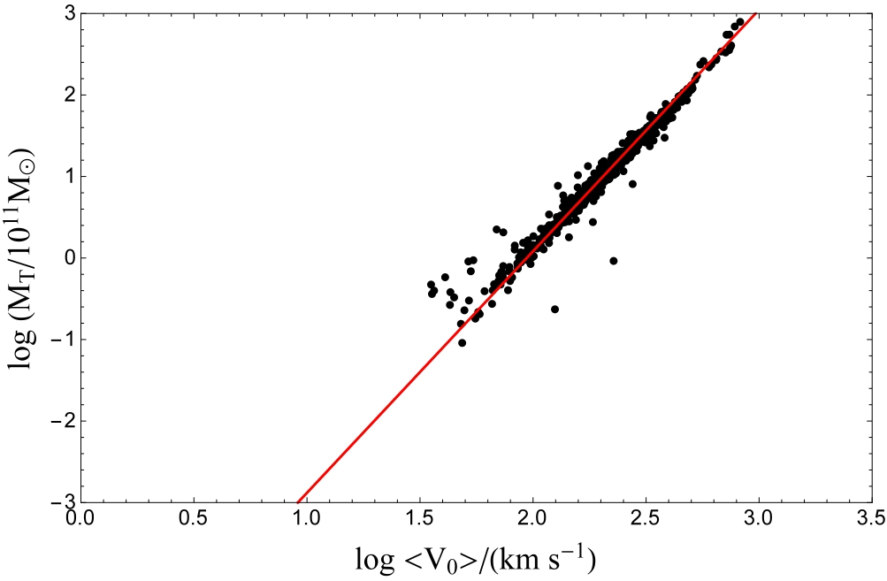

# Empirical Velocity Profiles
This `README.md` covers the essential details and results derived from the article "Empirical Velocity Profiles for Galactic Rotation Curves", published in MNRAS, and includes the relevant mathematical formulations. You can integrate this into your Git repository's documentation for clarity and completeness.

### Author:
E. López Fune

### Abstract:
This repository contains the code and datasets used for the study of a unified parametrization of circular velocity, which fits 850 galaxy rotation curves. The goal is to estimate total galactic mass and explain dark matter halo contributions without relying on prior knowledge of luminous matter components or fixed dark matter models. A key result is the ability to describe a galaxy's structure by transitioning from flat rotation curves to Keplerian fall-off based on Newtonian gravity.

## Key Features:
- Empirical formulae for fitting galactic rotation curves.
- Methods for computing dark matter densities and estimating total galaxy mass.
- Comprehensive datasets and results of fitting 850 galaxy rotation curves.

## Formulae:

### 1. Centrifugal Equilibrium Equation:
The dynamics of galaxy rotation curves are governed by the equation:

$$\frac{V^2(r)}{r} = a_h(r) + a_s(r) + a_g(r)$$

where:
- $V(r)$ is the total circular velocity at distance $r$, as derived from the galactic rotation curve
- $a_h(r)$, $a_s(r)$, and $a_g(r)$ are radial accelerations due to dark matter halo, stellar disk, and gaseous disk respectively.

### 2. Dark Matter Halo Density:
Assuming a spherical dark matter halo, the local dark matter density is computed as:

$$\rho_h(r) = \frac{1}{4\pi G r^2} \frac{d}{dr} \left( r V^2(r) - r V^2_s(r) - r V^2_g(r) \right)$$

Where:
- $V_s(r)$ and $V_g(r)$ are the circular velocity contributions from stellar and gaseous components.

After some finite lengh-scales, characteristics of the stellar and gaseous disks, the stellar and gaseous contributions to the local dark matter density vanish, so this local density can be estimated directly from the experimental rotation curve and not depending on any photometric measurements to account for the baryonic component. The drawback is that we need an analytical expression for $V(r)$ in order to be able to compute derivatives. In the next section, I will introduce a velocity profile deduced from empirical observations, and it was the core of my [Ph.D. thesis](https://iris.sissa.it/handle/20.500.11767/57108). 

### 3. Empirical Velocity Profile:
To fit galaxy rotation curves, the following empirical velocity profile was introduced:

$$V_n(r) = \dfrac{V_0 d^n (r/r_c)^{3/2} (1 + r/r_c)^{-(n + 1/2)}}{\sqrt{1 + (r/r_c)^2}}\sum_{i=0}^n \left( \dfrac{r/r_c}{d} \right)^i$$

Where:
- $V_0$ is the asymptotic circular velocity,
- $r_c$ is a radial scale,
- $d$ and $n$ are dimensionless fitting parameters.

But how did this formula come to my mind? Well, I will provide the full explanation of how I derived it, which was not included in the original [article](https://academic.oup.com/mnras/article/475/2/2132/4768263) nor in my [Ph.D. thesis](https://iris.sissa.it/handle/20.500.11767/57108).

It all comes to this [article](https://doi.org/10.1093/mnras/stx429), when observing the experimental rotation curve of the galaxy **M33**. To use the local dark matter density framework, I needed an analytical formula for the experimental points, which I proposed a very simple algebraic fraction that at large distances, produces a completely flat curve: 

$$V(r) = V_0\dfrac{(r/r_c) + d}{(r/r_c ) + 1}$$

where:
- $V_0$ is the asymptotic circular velocity,
- $r_c$ is a radial scale,
- $d$ is a dimensionless fitting parameter.

I was interested in the centrifugal acceleration $a(r)=V^{2}(r)/r$, which expands as :

$$a(r) = \dfrac{V^2_0}{r_c}\left(\frac{r}{r_c}\right)^2\left(\dfrac{1}{(\frac{r}{r_c})(1+\frac{r}{r_c})^2} + d \dfrac{1}{(\frac{r}{r_c})^2(1+\frac{r}{r_c})^2} + d\left(\dfrac{1}{(\frac{r}{r_c})^2(1+\frac{r}{r_c})^2} + d \dfrac{1}{(\frac{r}{r_c})^3(1+\frac{r}{r_c})^2}\right) \right)$$

from where one can recognize the Navarro-Frenk-White (NFW) density profile shape functions $\frac{1}{(r/r_c)^n(1+r/r_c)^2}$, where $n$ is a positive integer number, by coincidence, let's say. The NFW density profile has $n=1$.

The expression for $a(r)$ looks like a power expansion in $d$ till the second order, with the power of $d$ the same as $n$. Generalizing it till order $n$, I obtained, for the velocity profile:

$$V_n(r) = \dfrac{V_0 d^n (r/r_c)^{2-n}}{1 + r/r_c}\sum_{i=0}^n \left(\dfrac{r/r_c}{d}\right)^i .$$

If instead of using the NFW density profile, I use the Burkert one $\frac{1}{(1+r/r_c)(1+(r/r_c)^2)}$, then the derived velocity profile obtained is:

$$V_n(r) = \dfrac{V_0 d^n (r/r_c)^{3/2} (1 + r/r_c)^{-(n + 1/2)}}{\sqrt{1 + (r/r_c)^2}}\sum_{i=0}^n \left(\dfrac{1+r/r_c}{d} \right)^i .$$

I ran some tests using 850 experimental rotation curves, but when writing the code in Wolfram Mathematica, I forgot to write the 1+ in the fraction inside the sum in the last term of the above formula, which coincide with the initial one presented at the beginning of the section. Long story short, I relized about that and I did again the tests with both formulas, but to my surprised the one without the 1+ gave better results, so the final empirical formula used was :

$$V_n(r) = \dfrac{V_0 d^n (r/r_c)^{3/2} (1 + r/r_c)^{-(n + 1/2)}}{\sqrt{1 + (r/r_c)^2}}\sum_{i=0}^n \left( \dfrac{r/r_c}{d} \right)^i .$$

### 4. Gravitational Potential:
The gravitational potential that induces the circular velocity $V_n(r)$ is derived as:

$$\frac{d\Phi_n(r)}{dr} = -\dfrac{V_0^2 d^{2n}}{r_c} \dfrac{(r/r_c)^2 (1 + r/r_c)^{-(2n + 1)}}{1 + (r/r_c)^2}\sum_{i=0}^{2n} C_{(i,n)} \left( \frac{r/r_c}{d} \right)^i$$

where $C_{(i,n)}=i+1$ for $0\leq i \leq n$, and $C_{(i,n)}=2n-i+1$ for $n\leq i \leq 2n.$ Notice that to the gravitational potential contribute $2n+1$ components, but there is one which is not conventional to the known Newtonian physics, that is in charge of producing the flat part of the rotation curves. In fact, at large distances, $\Phi_n(r)$ presents a logarithmic divergence, pointing out that the Universe should be bound to only one galaxy, as it doesn't matter the mass of any particle, it will always be bound to this galaxy. 

This is obviously not observed in any the daily experience, so this gravitational potential is needing a renormalization. The details of the renormalization procedure can be found in the original [article](https://academic.oup.com/mnras/article/475/2/2132/4768263) and in my [Ph.D. thesis](https://iris.sissa.it/handle/20.500.11767/57108), with the introduction of the renormalized quantities $\langle V_0\rangle$ and $\langle V_c\rangle$, and the renormalization length-scale $r_{\text{edge}}$ that represents the edge of the galaxy. 

|  |  |
|:----------------------------------------------------------:|:----------------------------------------------------------:|
| Renormalized gravitational potential for $d=0.7$           | Renormalized gravitational potential for $d=1.3$           |

|           |          |
|:-----------------------------------------------------------:|:----------------------------------------------------------:|
| Velocity profiles with renormalized parameters for $d=0.7$  | Velocity profiles with renormalized parameters for $d=1.3$ |

### 5. Total Galaxy Mass Estimation:
The renormalized total mass of the galaxy, including dark matter, is given by:

$$M_T = M_0 \dfrac{d^{2n} x^4 (1 + x)^{-(2n+1)}}{1 + x^2} \sum_{i=0}^{2n} C_{(i,n)} \left(\dfrac{x}{d}\right)^i,$$

where $x=r_{\text{edge}}/2\langle r_c\rangle$, $M_0 = \frac{\langle V_0\rangle^2 \langle r_c\rangle}{G}$. 

## Results:
1. **Rotation Curve Fitting**: The empirical profile fits 850 galaxy rotation curves with an unprecedented degree of accuracy.

|           |   |
|:-----------------------------------------------------------:|:----------------------------------------------------------:|
| Results of the fitting with the RC of M33                   | Results of the fitting with the RC of UGC 477              |

2. **Mass Estimation**: The method estimates total mass $M_T$, including both luminous and dark matter components.
3. **Tully-Fisher Relation**: A Tully-Fisher-like relation was found, with a power-law correlation between total mass and asymptotic velocity:

   $$\log \left( \frac{M_T}{10^{11} M_\odot} \right) = -(5.84\pm0.01) + (2.96\pm0.01) \log \left( \frac{\langle V_0\rangle}{\text{km/s}} \right)$$

with a slope in full agreement with $\Lambda-CDM$ predictions.

## Datasets:
The data used for this study comprises 850 galaxy rotation curves, including both dwarf and spiral galaxies. You can access the complete set of fitted rotation curves in the directory [graphics](https://github.com/elopezfune/Empirical-Velocity-Profiles/tree/main/graphics).

## Contributing:
Contributions are welcome! 

## References: 
1. Persic, M., et al. (1995), Rotation Curves of Spiral Galaxies.
2. Oh, et al. (2015), Dwarf Spiral Galaxies Rotation Curves.
3. López Fune, E., et al. (2016), Dark Matter Halo Properties.
4. (see the full list of references in the [article](https://academic.oup.com/mnras/article/475/2/2132/4768263) )

---
